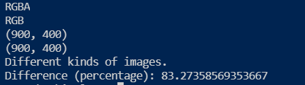

# Image Comparision

 Comparing Two Images and finding the difference
 
## *Packages*
### 1)pngjs
#### `npm install pngjs  --save`
### 2)gm
#### `npm install gm`
### 3)sharp
#### `npm install sharp`
### 4)pixelmatch
#### `npm install pixelmatch`

## importing to the javascript file 
```js
const PNG = require('pngjs').PNG;
const gm = require('gm');
const sharp = require('sharp');
const match = require('pixelmatch');
```
## Resizing Image 
for resizing image i had used the below code
```js
sharp(inputFile).resize({ height: 400 ,width:900}).toFile(outputFile)
    .then(function(newFileInfo) {
        console.log("Hello")
        console.log("Success")
    })
    .catch(function(err) {
        console.log("Error occured");
    }

 Comparing Two Images and finding the difference using Phython
 
## *Libraries*
### 1)os
```python
from os import read
import os
```
### 2)PIL
#### `pip install Pillow`
```python
from PIL import Image
```

## Reading Image 
for resizing image i had used the below code
```python
i1 = Image.open(os.path.join(r'f:/EthicalHat/ImageComparision/output.png'))
i2 = Image.open(os.path.join(r'f:/EthicalHat/ImageComparision/output1.png'))

);
```

## *Example1*


*Image-1*  
 
*Image-2* 

*Output*


#### *Image-1*  
 
#### *Image-2* 

#### *Output*


### *Instructions*
##### 1)Can check for same dimension of Images
##### 2)It can check for same type of images only

