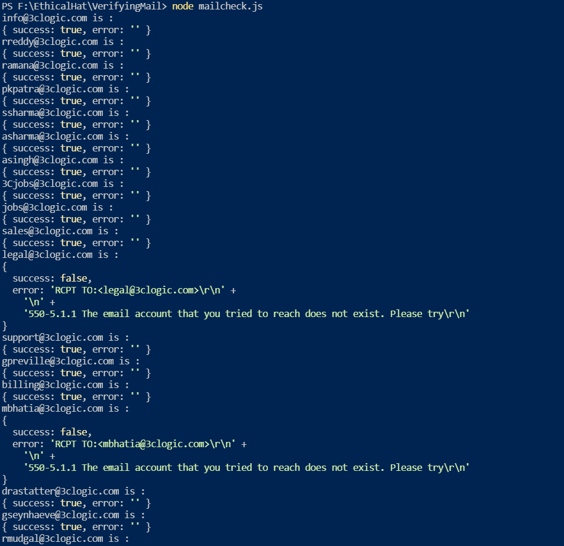
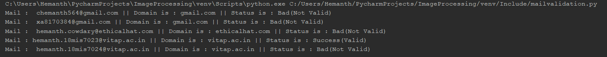

# ValidatingMails

 Mail validation
 
 # Validation Mails Using NodeJs
 Mail validation Using Python and Node Js
 
# Validation Mails Using NodeJs
Files related to javascript are in the testing branch
## *Packages*
### 1)email-lookup
#### `npm i email-lookup`

## importing to the javascript file 
```js
const { verifyExistence } = require('email-lookup');
```


## Output


# Validation Mails Using Python
Files related to python are in the testing branch
## *Packages*
### 1)smtplib
#### `pip install secure-smtplib`
### 2)dns.resolver


## importing to the python file 
```python
import re
import smtplib
import dns.resolver
```
 
